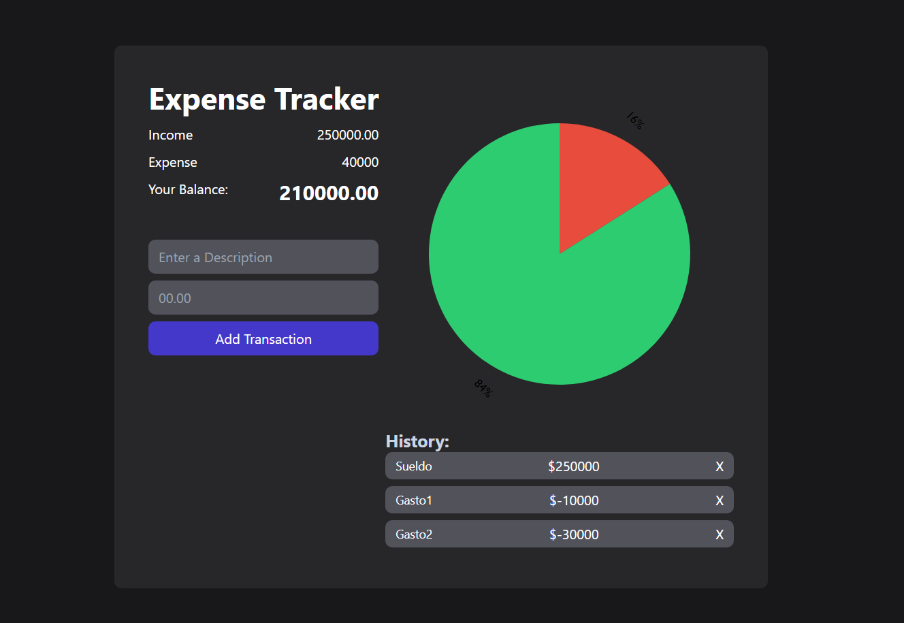

## <h1 align="center">⚡Expense-Tracker</h1> 

Mi primera aplicación con React, NPM, Vite
 

Expense Tracker que te ayuda a visualizar fácilmente un balance de Ingresos y Gastos

## 💟 Preview
 
   
 

## 💻 Tecnologías Utilizadas 

## 🌼 URL 
Pronto estaré realizando el deploy del mismo y proporcionando acceso a verlo e interactuar con el proyecto

## 🛠 Cómo usar
Cuando se ingresa a la página se pueden visualizar a la izquierda un formulario con un input para lo ingresos y gastos (Es el mismo inpu para los dos, el sistema los diferencia dependiendo de si ingresamos los dígitos como enteros o decimales, ya sea positivos para los ingrsesos y negativos para los gastos) y un input de descripción del mismo. Una vez ingresados los datos, el botón de Agregar Transacción permite no sólo agregarlo a la lista de la derecha , sino poder visualizar en un gráfico, rápidamente, cuánto disponemos de nuestros ingresos, cuánto hemos gastado y el detalle de los mismos.  

## ⚙ Recursos Utilizados
<a href="https://www.youtube.com/watch?v=zN6xXtHww54" target="_blank">Curso de Fazt</a>
- Si bien, ya tenía algunos conceptos de React, y me encuentro aprendiendo, quería poner esos conocimientos en una aplicación real.
- Por lo que este curso me ayudó a tener una idea a implementar y a guiarme cuando me equivocaba, a practicar sobre lo aprendido.

## Estado del Proyecto
 En Progreso.
 - El gráfico requiere de un mensaje cuando no tenga datos para mostrar
 - La aplicación requiere de testeos (se utilizará Jest para los mismos)

